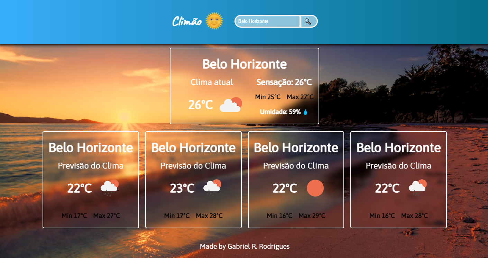
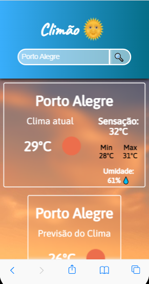

# Projeto Climão

## Opa, oi oi! Esse é um projeto com fins de estudos em react e styled-components, e o resultado você pode acessar clicando aqui!

A aplicação permite consulta em tempo real em uma API de climatologia.

## 👨‍💻 Linguagens e bibliotecas utilizadas:

- React
- Styled-Components
- Axios

## 📱 Dispositivos homologados:
A aplicação opera nas seguintes dimensões de telas:
- 1440px
- 720px
- 480px
- 380px

## 🔮 Usando a aplicação
Você pode fazer consultas em cidades do mundo todo, da seguinte maneira:
- Cidades brasileiras, utilize apenas o nome da cidade;
- Para cidades extrangeiras, utilize o nome nativo ( na língua local) da cidade, e em seguida adiciona a sigla do país.
Ex: London,uk.

